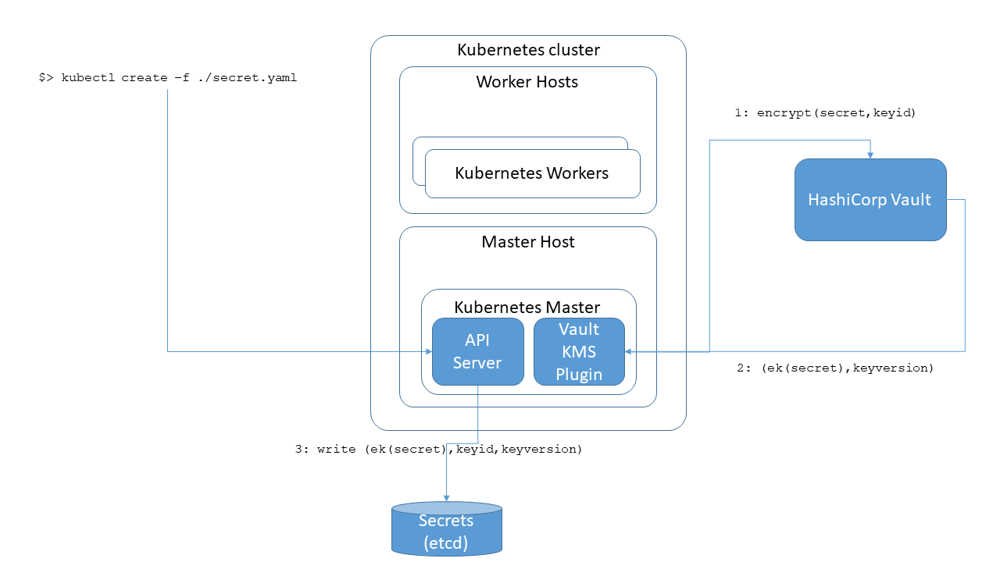

# Kubernetes KMS Plugin Provider for HashiCorp Vault

Kubernetes 1.10 ([PR 55684](https://github.com/kubernetes/kubernetes/pull/55684), [Docs](https://kubernetes.io/docs/tasks/administer-cluster/kms-provider/)) added the ability to:
* Abstract the encryption provider from the Kubernetes API server
* Manage the encryption external to the Kubernetes cluster in a remote KMS

This Kubernetes KMS Plugin Provider for HashiCorp Vault extends the previous functionality and enables an end state setup as shown in the following diagram.



# About the Kubernetes KMS plugin provider for HashiCorp Vault
The Kubernetes KMS Plugin Provider for HashiCorp Vault implementation is a simple adapter that adapts calls from Kubernetes to HashiCorp Vault APIs using configuration that determines how the plugin finds the HashiCorp Vault installation.
The plugin is implemented based on the Kubernetes contract as described in [Implementing a KMS plugin](https://kubernetes.io/docs/tasks/administer-cluster/kms-provider/#implementing-a-kms-plugin).

# Getting Started
Before building the KMS plugin provider for HashiCorp Vault, it is highly recommended that you read and understand [Encrypting Secret Data at Rest](https://kubernetes.io/docs/tasks/administer-cluster/encrypt-data/) and [Using a KMS provider for data encryption](https://kubernetes.io/docs/tasks/administer-cluster/kms-provider/) to understand how Kubernetes encrypts secrets at rest.

# Requirements
The Kubernetes KMS Plugin Provider for HashiCorp Vault has the following requirements:
* Kubernetes 1.10 or later
* [Go](https://golang.org/) 1.9 or later

# Building the KMS plugin provider for HashiCorp Vault
To build the KMS plugin provider:
```
mkdir -p $GOHOME/github.com/oracle
cd $GOHOME/github.com/oracle
git clone git@github.com:oracle/kubernetes-vault-kms-plugin.git
go install github.com/oracle/kubernetes-vault-kms-plugin/vault/server
```

# Starting the KMS plugin provider for HashiCorp Vault  
Note: The KMS Plugin Provider for HashiCorp Vault must be running before starting the Kubernetes API server.

To start the plugin provider:
1. Create a `vault-plugin.yaml` configuration file as shown in the following sample, using values appropriate for your configuration.
```yaml
keyNames:
  - kube-secret-enc-key
transitPath: /transit
ca-cert: /home/me/ca.cert
addr: https://example.com:8200
token: <token>
```

2. Run the following command to start the plugin.
```
$GOHOME/bin/server -socketFile=<location of socketfile.sock> -vaultConfig=<location of vault-plugin.yaml>
```

# Configuring the Kubernetes cluster for the KMS Plugin Provider for HashiCorp Vault

To configure the KMS plugin provider for Vault on the Kubernetes API server, edit the `encryption-config.yaml` configuration file on the server as follows:
1. Include a provider of type `kms` in the providers array.
2. Specify `vault` as the name of the plugin provider.
3. Set the following properties as appropriate for your configuration:
 * `endpoint`: Listen address of the gRPC server (KMS plugin). The endpoint is a UNIX domain socket.
 * `cachesize`: Number of data encryption keys (DEKs) to be cached in the clear.

 ```yaml
kind: EncryptionConfig
apiVersion: v1
resources:
  - resources:
    - secrets
    providers:
    - kms:
        name: vault
        endpoint: unix:///tmp/kms/socketfile.sock
        cachesize: 100
    - identity: {}  
```
See [Configuring the KMS provider](https://kubernetes.io/docs/tasks/administer-cluster/kms-provider/#configuring-the-kms-provider).

# Verifying the configuration
You can verify the configuration by starting the Kubernetes API server and testing the features as described in  [Encrypting your data with the KMS provider](https://kubernetes.io/docs/tasks/administer-cluster/kms-provider/#encrypting-your-data-with-the-kms-provider).

